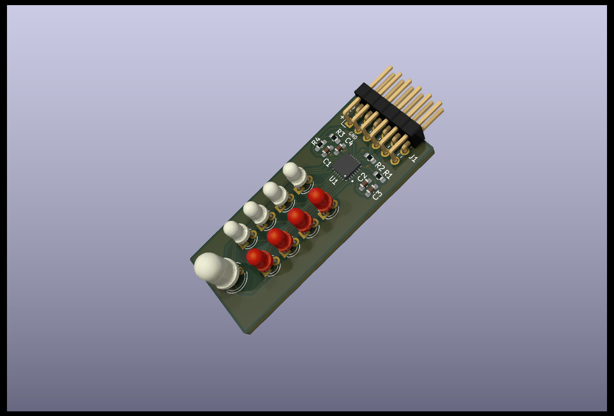
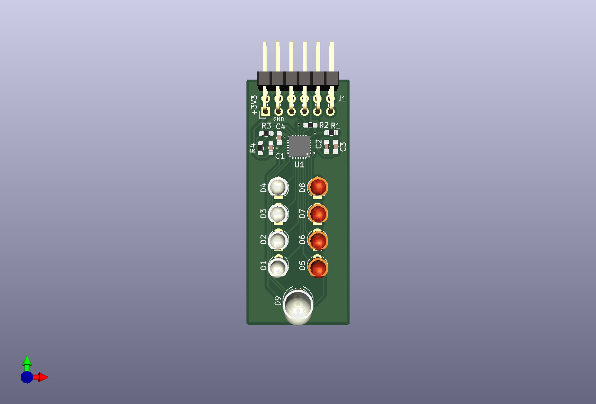
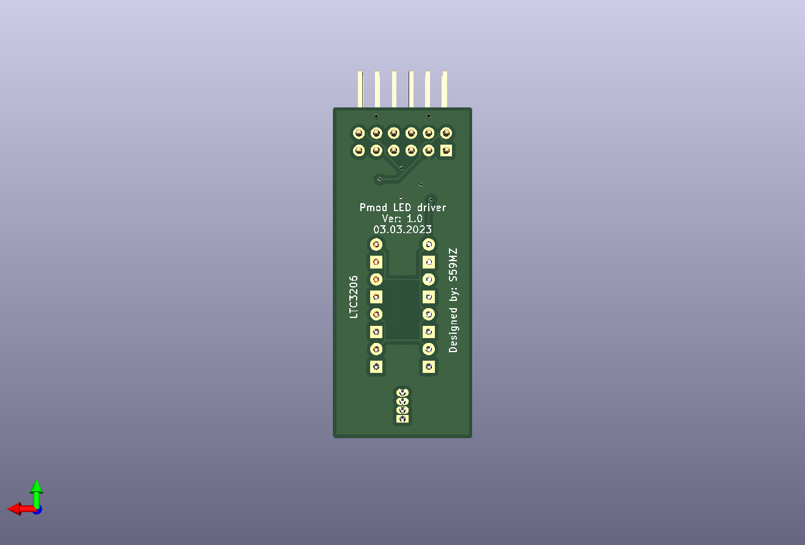

# led_drv_pmod
PMOD PCB module for LTC3206 LED driver 

Schematic:
[led_drv_pmod.pdf](led_drv_pmod.pdf)

BOM:
[led_drv_pmod.csv](led_drv_pmod.csv)

Gerbers:
[gerbers.zip](https://github.com/s59mz/kicad-led-drv-pmod/raw/main/gerbers.zip)
